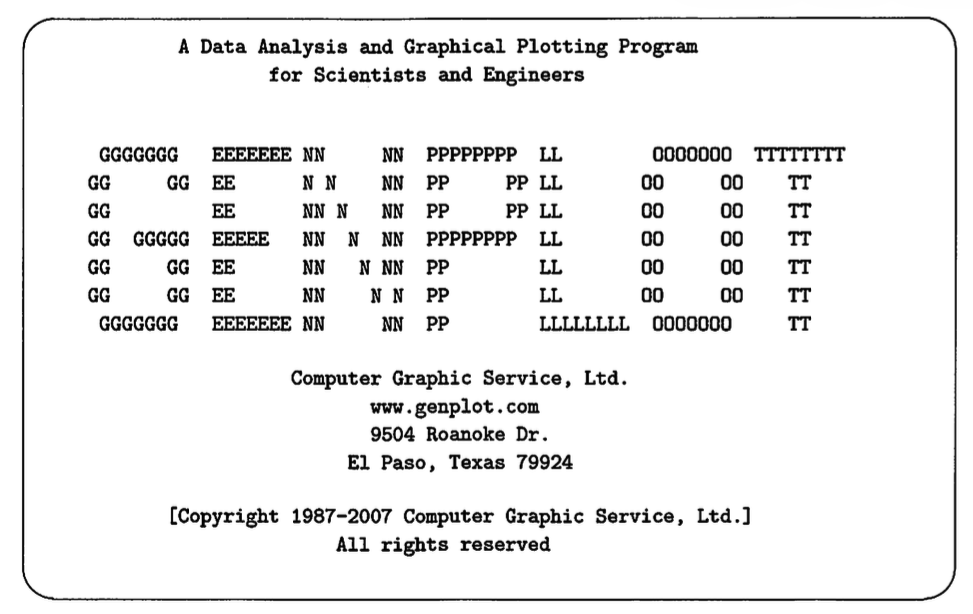

# Rump and Genplot — Source Code Archive

Archived source code of the **GENPLOT** scientific plotting package and the **RUMP** Rutherford Backscattering Spectrometry analysis tool, retrieved from genplot.org before the site went offline. Preserved here for historical and scientific reference.

---

## What is this?

This repository contains the C source code and offline HTML documentation copied from the [genplot.org](https://web.archive.org/web/*/genplot.org) website (now defunct). The code was hosted in a section of the site that was not crawled by the Internet Archive and is no longer publicly accessible. It is placed here as-is, with no modifications, for the benefit of researchers who may still need it.

---

## About the software

### GENPLOT

GENPLOT is a command-line scientific data analysis and plotting package aimed at researchers who are comfortable with typed commands. It supports curve fitting, data manipulation, and high-quality output to a variety of devices. It was designed to run on Unix/POSIX systems and has platform-specific makefiles for:

| Platform | Makefile |
|----------|----------|
| Linux | `makelnx` |
| macOS | `makeosx` |
| GNU/GCC | `makegnu` |
| AIX | `makeaix` |
| HP-UX 7 | `makehp7` |
| Solaris | `makesolaris` |
| SGI IRIX | `makesgi` |
| OSF/Tru64 | `makeosf` |
| Convex | `makecvx` |

Source lives in `genplot/`.

---

### RUMP

RUMP is a Rutherford Backscattering Spectrometry (RBS) analysis, plotting, and simulation package built on top of GENPLOT. It includes three tightly integrated components:

- **RUMP** — spectrum reading, plotting, and basic RBS analysis
- **SIM** — layer-by-layer sample definition and forward simulation
- **PERT** — semi-automatic least-squares refinement of a simulation against measured data

RUMP was originally written in FORTRAN at Cornell University in Dr. J.W. Mayer's research group by L.R. Doolittle, M.O. Thompson, and R.C. Cochran, then fully rewritten in C. Source lives in `rump/`.

---

## Repository layout

| Path | Contents |
|------|----------|
| `genplot/` | GENPLOT core source |
| `rump/` | RUMP/SIM/PERT source |
| `html/` | Offline copy of the original HTML documentation |
| `html/GENPLOT/` | GENPLOT reference manual |
| `html/RUMP/` | RUMP/SIM/PERT reference manual |
| `html/CGS/` | CGS legal and warranty pages |
| `bin/` | Utility programs |
| `complot/` | Plot driver library |
| `hershey/` | Hershey vector font data |
| `lexp/` | Expression parser library |
| `vsort/` | Sort utilities |
| `sys/` | System portability layer |
| `mtwist-1.1/` | Mersenne Twister random number library |
| `make*` | Platform-specific makefiles |

---

## Attribution

**Original authors:** L.R. Doolittle, M.O. Thompson, R.C. Cochran (Cornell University, Dr. J.W. Mayer's group)  
**Original distributor:** Computer Graphic Service, Ltd. (CGS) — dissolved June 2012  
**Author contact (as of last known):** mot1@cornell.edu

CGS ceased operations in June 2012 due to Cornell University's Conflict of Interest policies. The software was subsequently made freely available by the original author. The original legal terms and warranty text as published by CGS are preserved verbatim in [`html/legal.htm`](html/legal.htm) and [`html/CGS/warranty.htm`](html/CGS/warranty.htm).

---

## Disclaimer

This repository is an **archival copy** maintained by a third party. The archiver:

- makes **no claim of ownership** over any part of this code or documentation;
- provides this archive **with no warranty of any kind** — neither expressed nor implied;
- accepts **no liability** for any use or misuse of this code;
- has **no affiliation** with CGS, Cornell University, or the original authors.

The code is provided strictly for historical preservation and scientific reference. If you are the rights holder and wish this repository to be removed, please open an issue.
